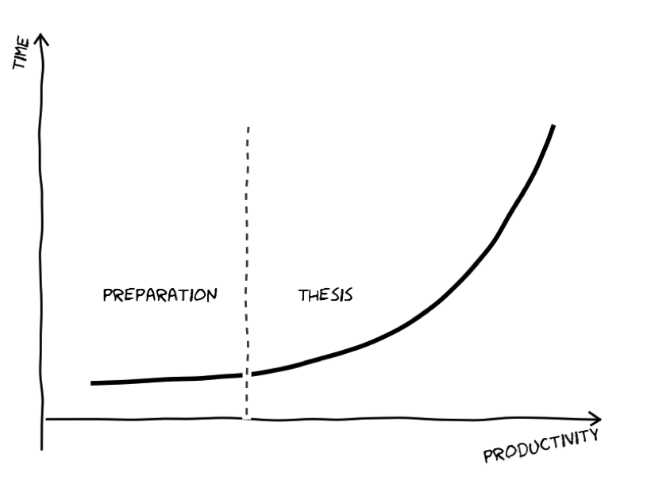
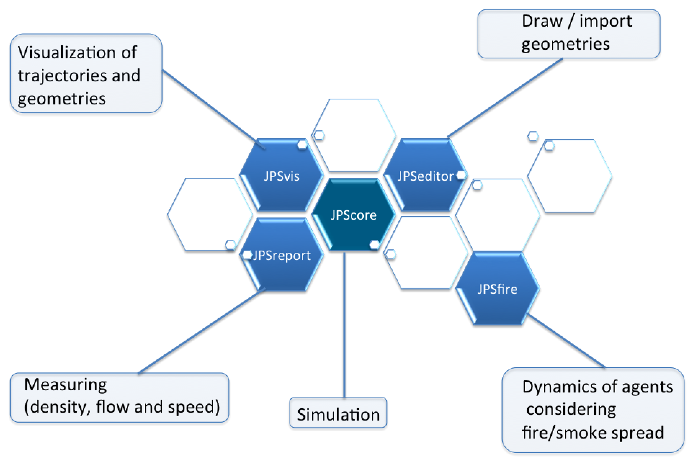

Open source framework for simulating and analyzing pedestrian dynamics.


## Goal

The primary goal of `JuPedSim` is to provide students and researchers with a framework to investigate pedestrian dynamics
and  focus on research, i.e. development and validation of new models or model features, analysis of experiments and proper visualization of results. 

For any scientist and especially for  bachelor/master/PhD students it is important to not loose time in   developing "help tools" 
e.g. scripts to visualize their results or editing geometries. 




`JuPedSim` is currently focusing on evacuation, but easily extendable to cover other areas 
e.g. passengers exchange, commuter traffic in railway stations etc.

Finally, JuPedSim also provides sample data sets for calibration and validation. 
We are developing some standards and benchmark scenarios for evaluation pedestrian simulations based on a large experimental database, 
which was established over the last years. See for example 

- [Jülich database](http://www.fz-juelich.de/ias/jsc/EN/Research/ModellingSimulation/CivilSecurityTraffic/PedestrianDynamics/Activities/database/databaseNode.html)
- [Wuppertal database](http://www.asim.uni-wuppertal.de/datenbank.html)


## Organization of the code

`JuPedSim` consists of four modules which are loosely coupled and can be used independently at the moment. These are:


1. `jpscore`: the core module computing the trajectories. See [list](http://jupedsim.github.io/jpscore/models/operativ) of implemented models.
2. `jpsreport`: a tool for analyzing the trajectories and validating the model. 
   It implements a couple of measurement methods including the [Voronoi-method](http://dx.doi.org/10.1016/j.physa.2009.12.015) for calculating the density.
3. `jpsvis`: a tool for visualizing the input (geometry) and output (trajectories) data.
4.  `jpseditor`: a tool for creating and editing geometry files with dxf import/export capabilities.




## Showcase and tutorials

To highlight some features of `JuPedSim` we have uploaded some videos and tutorials on
our [YouTube channel](https://www.youtube.com/channel/UCKS8w8CUClHEeN4K1SUSMBA).


## Quick Install

```shell
git clone https://github.com/JuPedSim/JuPedSim.git
cd JuPedSim
git submodule update --init --recursive
make -f Makefile.cmake check
```

Note: it is very important to update the submodule, otherwise the they will be empty!


`CMake` will eventually report any missing packages. Please fix these errors/warnings first **before** proceeding with the compilation of `JuPedSim` with 

```shell
make -f Makefile.cmake check release
```


## License

`JuPedSim` is published under 


## Repository

We use a self-hosted [Gitlab](http://cst.version.fz-juelich.de/) repository to develop the code. 
Our [GitHub](https://github.com/JuPedSim/JuPedSim) repository hosts selected branches and releases only.

When reporting a bug or an issue, please use ONLY the gitlab issue tracker.

## Download

Releases can be downloades [here](https://github.com/JuPedSim/JuPedSim/releases).


## Contact

info at jupedsim dot org


